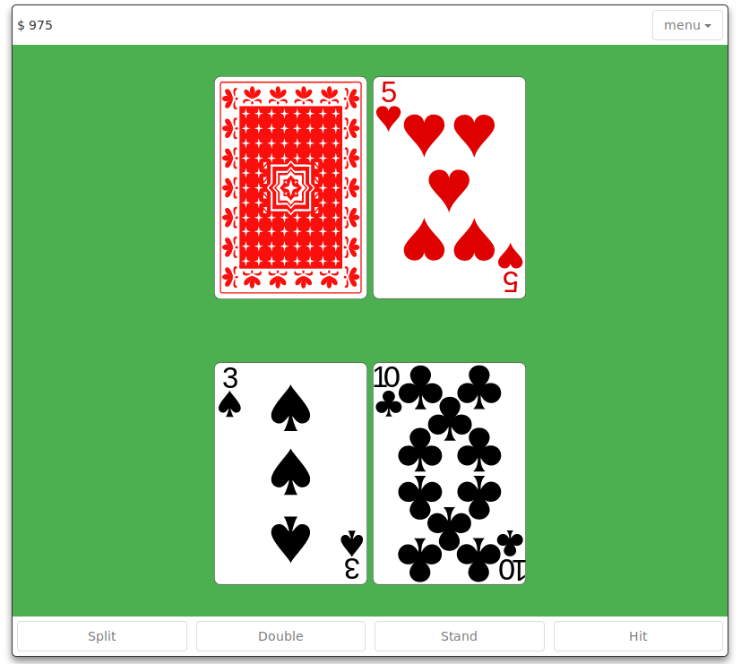

# BlackJack Trainer

**Note: This Is Still Very Much In Beta As I Work Through Known Bugs And Incomplete Features**

As stated, this is still very much in active development and is not yet ready for it's intended use.  That being said if you would like to check it out in it's current beta state, you can do so locally 
by cloning the repo and installing packages with `npm install`.

To launch the app run `npm start`

A very very special thanks to the creators of the svg playing card faces and back:

card faces: https://github.com/notpeter/Vector-Playing-Cards
card back:  https://commons.wikimedia.org/wiki/File:Card_back_01.svg
